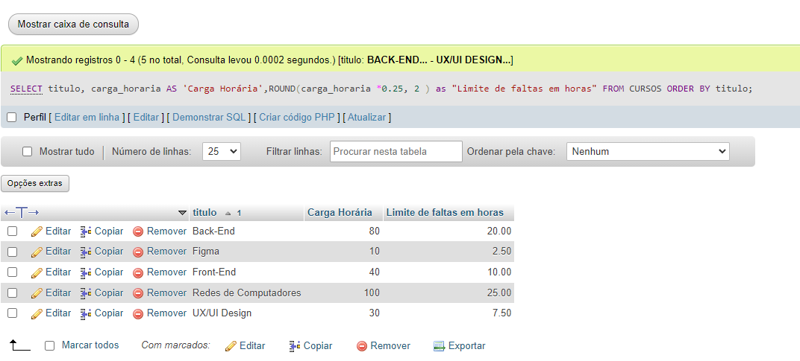
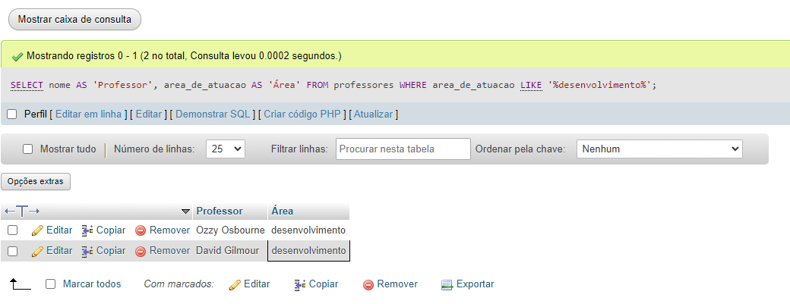

# Exercícios de Banco de Dados - Etapa 1


<!--  Crie um banco de dados chamado  -->
```sql
CREATE DATABASE tecinternet_escola_aline CHARACTER SET utf8mb4;
```


<!-- Criar tabela CURSO que fizemos no MySQL Workbench com está na foto -->
```sql
CREATE TABLE cursos(
    id TINYINT NOT NULL PRIMARY KEY AUTO_INCREMENT,
    titulo VARCHAR(30) NOT NULL,
    carga_horaria TINYINT,
    professor_id TINYINT NULL 
); 
```

<!-- Criar tabela PROFESSORES que fizemos no MySQL Workbench com está na foto -->
```sql
CREATE TABLE professores(
    id TINYINT NOT NULL PRIMARY KEY AUTO_INCREMENT,
    nome VARCHAR(50) NOT NULL,
    area_de_atuacao ENUM('design', 'desenvolvimento', 'infra')  NOT NULL,   
    curso_id TINYINT NOT NULL  
); 
```

<!-- Criar tabela ALUNOS que fizemos no MySQL Workbench com está na foto -->
```sql
CREATE TABLE alunos(
    id TINYINT NOT NULL PRIMARY KEY AUTO_INCREMENT,
    nome VARCHAR(50),
    data_de_nascimento DATE NOT NULL,
    primeira_nota DECIMAL(4,2) NOT NULL,
    segunda_nota DECIMAL(4,2) NOT NULL,
    curso_id TINYINT NULL
); 
```

<!--  Criando a chave-estrangeira -->
```sql
ALTER TABLE alunos
    
    ADD CONSTRAINT fk_alunos_cursos  
    FOREIGN KEY (curso_id) REFERENCES cursos(id);
```


```sql
ALTER TABLE cursos
    
    ADD CONSTRAINT fk_cursos_professores1 
    FOREIGN KEY (professor_id) REFERENCES professores(id);
```

```sql
ALTER TABLE professores
    
    ADD CONSTRAINT fk_professores_cursos1   
    FOREIGN KEY (curso_id) REFERENCES cursos(id);
```

# Exercícios de Banco de Dados - Etapa 2

### Cadastre pelo menos 5 cursos: 

<!-- Incluir No Tabela cursos TITULO e Carga Horaria-->
```sql
INSERT INTO cursos (
         titulo, carga_horaria ) 
    VALUES 
    ('Front-End', 40 ), -- linha 1

    ('Back-End', 80 ), -- linha 2

    ('UX/UI Design', 30 ), -- linha 3

    ('Figma', 10 ), -- linha 4

    ('Redes de Computadores', 100 ); -- linha 5
```

### Cadastre pelo menos 5 professores: 

<!-- Incluir No Tabela professores nome, area de atuação e curso_id -->
```sql
INSERT INTO professores (
         nome, area_de_atuacao, curso_id) 
    VALUES
    ('Jon Oliva', 'infra', 5 ), -- linha 1

    ('Lemmy Kilmister', 'design', 4 ), -- linha 2

    ('Neil Peart', 'design', 3 ), -- linha 3

    ('Ozzy Osbourne','desenvolvimento', 2 ), -- linha 4

    ('David Gilmour', 'desenvolvimento', 1 ); -- linha 5

```

### Atualize os dados do campo professor_id da tabela cursos, associando cada curso ao seu professor correspondente.

```sql
UPDATE cursos SET professor_id = 5 WHERE id =  1; -- Front-End

UPDATE cursos SET professor_id = 4 WHERE id =  2; -- Back-End

UPDATE cursos SET professor_id = 3 WHERE id =  3; -- UX/UI Design 

UPDATE cursos SET professor_id = 2 WHERE id =  4; -- Figma

UPDATE cursos SET professor_id = 1 WHERE id =  5; -- Redes de Computadores
```


### Cadastre pelo menos 10 alunos distribuidos aleatoriamente dentre os cursos, com datas de nascimento variadas, notas baixas e altas (sempre entre 0.00 e 10.00).

<!-- Incluir No Tabela professores nome, data_de_nascimento, primeira_nota, segunda_nota e curso_id -->
```sql
INSERT INTO alunos (
         nome, data_de_nascimento, primeira_nota, segunda_nota, curso_id ) 
    VALUES 
    ('Harry Potter', '1989-07-22', 8.00, 8.00 , 1 ), -- linha 1 - curso Front-End 

    ('Hermione Granger', '1990-04-15', 10.00, 10.00 , 2 ), -- linha 2 -  Back-End

    ('Rony Weasley', '1988-08-24', 8.00, 7.00 , 3 ), -- linha 3 -  UX/UI Design

    ('Gina Weasley', '1991-02-17', 9.00, 6.00 , 4 ), -- linha 4 -  Figma

    ('Luna Lovegood', '1991-08-16', 10.00, 6.00 , 5 ), -- linha 5 -  Redes de Computadores

    ('Draco Malfoy', '1987-09-22', 7.00, 4.00 , 1 ), -- linha 6 - curso Front-End 

    ('Severo Snape', '1946-02-21', 5.00, 5.00 , 2 ), -- linha 7 -  Back-End

    ('Sirius Black', '1958-03-21', 3.00, 7.00 , 3 ), -- linha 8 -  UX/UI Design

    ('Neville Longbottom', '1989-06-27', 9.00, 3.00 , 4 ), -- linha 9 -  Figma

    ('Rúbeo Hagrid', '1950-03-30', 4.00, 6.00 , 5 ); -- linha 10 -  Redes de Computadores

```


# Exercícios de Banco de Dados - Etapa 3

### 1) Faça uma consulta que mostre os alunos que nasceram antes do ano 2009

```sql
SELECT  nome, data_de_nascimento FROM alunos WHERE data_de_nascimento < '2009-12-31';
```


### 2) Faça uma consulta que calcule a média das notas de cada aluno e as mostre com duas casas decimais.

```sql 
SELECT nome AS 'ALunos',ROUND((primeira_nota + segunda_nota)/2, 2 ) as "Média das Notas" FROM alunos; 
```


### 3) Faça uma consulta que calcule o limite de faltas de cada curso de acordo com a carga horária. Considere o limite como 25% da carga horária. Classifique em ordem crescente pelo título do curso.

```sql
SELECT titulo, carga_horaria AS 'Carga Horária',ROUND(carga_horaria *0.25, 2 ) as "Limite de faltas em horas" 
FROM CURSOS ORDER BY titulo;
```


### 4) Faça uma consulta que mostre os nomes dos professores que são somente da área "desenvolvimento".

```sql
SELECT nome AS 'Professor', area_de_atuacao AS 'Área' 
FROM professores WHERE area_de_atuacao LIKE '%desenvolvimento%'; 
```


### 5) Faça uma consulta que mostre a quantidade de professores que cada área ("design", "infra", "desenvolvimento") possui.

```sql
SELECT area_de_atuacao, COUNT( * ) as "Qtd de Professores Por Cursos" 
FROM professores 
GROUP BY area_de_atuacao; 
```


### 6) Faça uma consulta que mostre o nome dos alunos, o título e a carga horária dos cursos que fazem.

```sql
SELECT alunos.nome AS 'Alunos', cursos.titulo AS 'Titulo', cursos.carga_horaria AS 'Carga Horária' 
FROM alunos 
INNER JOIN cursos 
ON alunos.curso_id = cursos.id;
```


### 7) Faça uma consulta que mostre o nome dos professores e o título do curso que lecionam. Classifique pelo nome do professor.

```sql
SELECT professores.nome AS 'Professor', cursos.titulo AS 'Titulo' FROM professores 
INNER JOIN cursos ON professores.curso_id = cursos.id 
ORDER BY nome;
```


### 8) Faça uma consulta que mostre o nome dos alunos, o título dos cursos que fazem, e o professor de cada curso.

```sql
SELECT alunos.nome AS 'Alunos', cursos.titulo AS 'Titulo', professores.nome AS 'Professores' 
FROM alunos 
JOIN cursos 
ON alunos.curso_id = cursos.id 
JOIN professores 
ON cursos.professor_id = professores.id 
```


### 9) Faça uma consulta que mostre a quantidade de alunos que cada curso possui. Classifique os resultados em ordem descrecente de acordo com a quantidade de alunos.

```sql
SELECT
cursos.titulo AS 'Alunos',    
COUNT(alunos.curso_id) AS "Qtd de Cursos"
FROM alunos INNER JOIN cursos 
ON alunos.curso_id = cursos.id 
GROUP BY cursos.titulo  
ORDER BY COUNT(alunos.curso_id) DESC; 
```


### 10) Faça uma consulta que mostre o nome dos alunos, suas notas, médias, e o título dos cursos que fazem. Devem ser considerados somente os alunos de Front-End e Back-End. Mostre os resultados classificados pelo nome do aluno.


