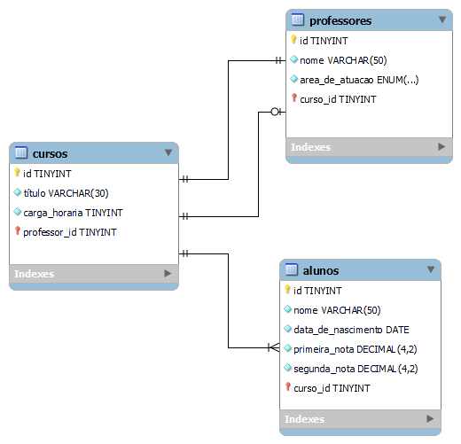

<!--  Crie um banco de dados chamado  -->
```sql
CREATE DATABASE tecinternet_escola_aline CHARACTER SET utf8mb4;
```


<!-- Criar tabela CURSO que fizemos no MySQL Workbench com está na foto -->
```sql
CREATE TABLE cursos(
    id TINYINT NOT NULL PRIMARY KEY AUTO_INCREMENT,
    titulo VARCHAR(30) NOT NULL
    carga_horaria  TINYINT 
    professor_id TINYINT NULL 
); 
```

<!-- Criar tabela PROFESSORES que fizemos no MySQL Workbench com está na foto -->
```sql
CREATE TABLE professores(
    id TINYINT NOT NULL PRIMARY KEY AUTO_INCREMENT,
    nome VARCHAR(50) NOT NULL
    area_de_atuacao ENUM('design', 'desenvolvimento', ' infra')  NOT NULL   
    curso_id TINYINT NOT NULL  
); 
```

<!-- Criar tabela ALUNOS que fizemos no MySQL Workbench com está na foto -->
```sql
CREATE TABLE alunos(
    id TINYINT NOT NULL PRIMARY KEY AUTO_INCREMENT,
    nome VARCHAR(50)
    data_de_nascimento DATE NOT NULL
    primeira_nota DECIMAL(4,2) NOT NULL
    segunda_nota DECIMAL(4,2) NOT NULL
    curso_id TINYINT NULL
); 
```


<!--  Criando a chave-estrangeira -->
```sql
ALTER TABLE alunos
    
    ADD CONSTRAINT fk_alunos_cursos  
    FOREIGN KEY (curso_id) REFERENCES cursos(id);
```


```sql
ALTER TABLE cursos
    
    ADD CONSTRAINT fk_cursos_professores1 
    FOREIGN KEY (professore_id) REFERENCES professores(id);
```

```sql
ALTER TABLE professores
    
    ADD CONSTRAINT fk_professores_cursos1   
    FOREIGN KEY (curso_id) REFERENCES cursos(id);
```


